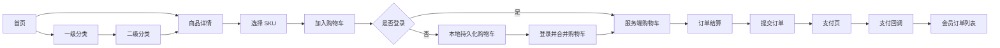

# small_rabbit 小兔鲜商城

> 基于 Vue 3 实现的电商前台练习项目，覆盖商品浏览、SKU 选择、购物车、订单结算、支付回调和会员订单等典型商城业务。
## 测试账户
个人账号：heima289
个人密码：hm#qd@23!

支付账号：scobys4865@sandbox.com
支付密码：111111

## 项目介绍

small_rabbit 是一个用于学习 Vue 3 和电商业务流程的前端项目。项目以消费者购物流程为主线，实现了首页推荐、商品分类、商品详情、登录、购物车、订单结算、支付和会员中心等页面。

本项目的重点不只是页面展示，还包括以下前端工程实践：

- 使用 Vue Router 组织公共布局、动态路由和会员中心嵌套路由。
- 使用 Pinia 管理用户、商品分类和购物车等跨页面状态。
- 使用持久化插件保存登录信息和本地购物车。
- 使用 Axios 实例统一处理接口地址、token、错误提示和登录失效。
- 区分未登录购物车与已登录购物车，并在登录后合并数据。
- 使用可复用 SKU 组件、图片预览组件和自定义图片懒加载指令。

该项目适合作为 Vue 3 电商业务练习项目，不应描述为已经上线的大型商业商城。

## 核心功能

### 商品浏览

- 首页轮播图、新鲜好物、人气推荐和分类商品展示。
- 顶部一级分类导航与二级分类入口。
- 一级分类详情、二级分类筛选和商品列表。
- 商品详情、图片预览、放大镜和猜你喜欢。

### 商品规格与购物车

- 根据商品规格组合选择 SKU。
- 展示 SKU 对应的价格、库存和商品图片。
- 支持添加商品、修改数量、删除商品、单选和全选。
- 使用计算属性统计商品总数、总金额、选中数量和选中金额。
- 未登录时维护本地购物车，登录后读取服务端购物车。
- 登录成功后将本地有效商品合并到服务端购物车。

### 用户与订单

- 手机号、账号和密码表单校验与登录。
- 用户信息与 token 持久化。
- 预订单信息、收货地址选择和订单提交。
- 支付倒计时、支付跳转和支付结果回调。
- 会员中心个人信息与订单列表。

### 通用体验

- 公共头部、导航、吸顶导航、底部和商品卡片组件。
- Element Plus 消息提示、确认弹窗、分页、标签页和表单组件。
- 基于 Intersection Observer 的图片懒加载。
- 路由切换后自动回到页面顶部。

## 技术栈

| 技术 | 版本 | 在项目中的作用 |
| --- | --- | --- |
| Vue | `^3.5.29` | 使用 Composition API 和 `<script setup>` 开发页面与组件 |
| Vite | `^7.3.1` | 本地开发、热更新和生产构建 |
| Vue Router | `^5.0.3` | 页面路由、动态参数、嵌套路由和滚动行为 |
| Pinia | `^3.0.4` | 管理用户、分类和购物车状态 |
| pinia-plugin-persistedstate | `^4.7.1` | 持久化用户信息和购物车状态 |
| Axios | `^1.13.6` | HTTP 请求与请求/响应拦截器 |
| Element Plus | `^2.13.5` | 表单、弹窗、消息、分页和 Tabs 等 UI 组件 |
| VueUse | `^14.2.1` | 图片懒加载、滚动状态和鼠标位置等组合式能力 |
| dayjs | `^1.11.20` | 支付倒计时格式化 |
| Sass | `^1.98.0` | 全局变量、Element Plus 主题覆盖和组件样式 |
| ESLint / oxlint | 见 `package.json` | 代码规范检查与自动修复 |

Element Plus 通过 `unplugin-auto-import` 和 `unplugin-vue-components` 按需自动导入，相关配置位于 `vite.config.js`。

## 项目结构

```text
vue_rabbit/
├─ docs/                         # 项目业务、源码和面试复习文档
├─ public/                       # 不经过构建处理的公共资源
├─ src/
│  ├─ apis/                     # 按业务模块拆分的接口方法
│  │  ├─ cart.js                # 购物车接口
│  │  ├─ category.js            # 分类接口
│  │  ├─ checkout.js            # 预订单接口
│  │  ├─ detail.js              # 商品详情接口
│  │  ├─ home.js                # 首页接口
│  │  ├─ layout.js              # 公共分类导航接口
│  │  ├─ order.js               # 提交订单和订单列表接口
│  │  ├─ pay.js                 # 支付相关接口
│  │  └─ user.js                # 登录接口
│  ├─ assets/                   # 图片等静态资源
│  ├─ components/               # 全局复用组件
│  │  ├─ ImageView/             # 商品图片预览与放大镜
│  │  └─ XtxSku/                # SKU 规格选择组件
│  ├─ composables/              # 可复用组合式逻辑
│  │  └─ useCountDown.js        # 支付倒计时
│  ├─ directives/               # 自定义 Vue 指令
│  │  └─ index.js               # v-img-lazy 图片懒加载
│  ├─ router/
│  │  └─ index.js               # 路由表与滚动行为
│  ├─ stores/                   # Pinia 状态管理
│  │  ├─ cartStore.js           # 购物车状态与计算属性
│  │  ├─ category.js            # 分类导航状态
│  │  ├─ user.js                # 用户登录状态
│  │  └─ counter.js             # Pinia 示例 store，当前业务未明显使用
│  ├─ styles/                   # 全局样式、变量和主题覆盖
│  ├─ utils/
│  │  └─ http.js                # Axios 实例和拦截器
│  ├─ views/                    # 页面级组件
│  │  ├─ Layout/                # 商城公共布局
│  │  ├─ Home/                  # 首页
│  │  ├─ Category/              # 一级分类
│  │  ├─ SubCategory/           # 二级分类商品列表
│  │  ├─ Detail/                # 商品详情
│  │  ├─ CartList/              # 购物车
│  │  ├─ Checkout/              # 订单结算
│  │  ├─ Pay/                   # 支付和支付回调
│  │  ├─ Login/                 # 登录
│  │  └─ Member/                # 会员中心和订单列表
│  ├─ App.vue                   # 根组件
│  └─ main.js                   # 应用入口与插件注册
├─ package.json                 # 依赖、脚本和 Node.js 版本要求
└─ vite.config.js               # Vite、别名、自动导入和 Sass 配置
```

## 整体业务流程



步骤 1：用户进入 `/`，首页请求分类、轮播、新品、人气推荐和商品模块数据。

步骤 2：用户进入 `/category/:id` 或 `/category/sub/:id`，页面根据动态路由参数请求对应分类和商品列表。

步骤 3：用户进入 `/detail/:id`，详情页根据商品 id 获取图片、价格、库存、规格和详情信息。

步骤 4：用户选择完整 SKU 和购买数量后加入购物车。未登录时更新 Pinia 本地列表；已登录时先请求后端购物车接口，再刷新购物车数据。

步骤 5：用户在 `/cartlist` 完成勾选、全选、数量调整和删除，页面通过 Pinia 计算属性实时更新合计数据。

步骤 6：用户进入 `/checkout` 获取预订单信息，选择收货地址并提交订单。

步骤 7：创建订单后跳转 `/pay?id=订单ID`。支付完成后进入 `/paycallback` 展示结果，并可在 `/member/order` 查看订单。

## 页面路由

路由配置位于 `src/router/index.js`，使用 `createWebHistory` 创建 HTML5 History 路由。

| 路径 | 页面组件 | 说明 |
| --- | --- | --- |
| `/` | `src/views/Home/index.vue` | 商城首页 |
| `/category/:id` | `src/views/Category/index.vue` | 一级分类页，`id` 为一级分类 id |
| `/category/sub/:id` | `src/views/SubCategory/index.vue` | 二级分类与商品列表，`id` 为二级分类 id |
| `/detail/:id` | `src/views/Detail/index.vue` | 商品详情，`id` 为商品 id |
| `/cartlist` | `src/views/CartList/index.vue` | 购物车列表 |
| `/checkout` | `src/views/Checkout/index.vue` | 订单确认与结算 |
| `/pay` | `src/views/Pay/index.vue` | 支付页，通过 query 获取订单 id |
| `/paycallback` | `src/views/Pay/PayBack.vue` | 支付回调结果页 |
| `/member` | `src/views/Member/index.vue` | 会员中心布局，默认重定向到 `/member/user` |
| `/member/user` | `src/views/Member/component/UserInfo.vue` | 个人信息 |
| `/member/order` | `src/views/Member/component/UserOrder.vue` | 订单列表 |
| `/login` | `src/views/Login/index.vue` | 登录页，位于公共商城 Layout 之外 |

`Layout` 是商城主体页面的父级布局，通过 `<RouterView>` 渲染子页面。路由配置中的 `scrollBehavior` 会在切换页面后返回顶部。

当前路由组件采用静态导入，未使用动态 `import()` 做路由级懒加载；项目也未明显实现全局路由守卫。登录要求主要由业务入口和接口鉴权控制，生产项目可补充路由 `meta` 和 `beforeEach` 守卫。

## 核心实现说明

### 应用初始化

入口文件 `src/main.js` 主要完成以下工作：

1. 通过 `createApp` 创建 Vue 应用。
2. 创建 Pinia，并注册 `pinia-plugin-persistedstate`。
3. 注册 Vue Router。
4. 批量注册项目全局组件。
5. 注册 `v-img-lazy` 图片懒加载指令。
6. 挂载根组件到页面。

### Axios 请求封装

`src/utils/http.js` 创建独立 Axios 实例：

- `baseURL`：`https://pcapi-xiaotuxian-front-devtest.itheima.net`
- `timeout`：`10000ms`
- 请求拦截器：从用户 Pinia store 获取 token，并设置 `Authorization: Bearer <token>`。
- 响应拦截器：成功时直接返回 `res.data`，减少页面重复解构。
- 异常处理：使用 `ElMessage` 统一显示接口错误。
- 401 处理：清除用户信息并跳转 `/login`。

所有接口按照首页、分类、详情、购物车、结算、订单、支付和用户模块放在 `src/apis/` 中，页面不直接拼接请求地址。

注意：当前错误分支直接读取 `error.response.status`。网络断开、超时或请求被取消时，`response` 可能不存在，后续可改为可选链判断并提供兜底错误文案。

### Pinia 与持久化

项目的三个核心 store：

- `src/stores/user.js`：保存用户信息和 token，处理登录、退出及登录后的购物车合并。
- `src/stores/category.js`：保存公共分类导航数据。
- `src/stores/cartStore.js`：保存购物车列表，并提供数量、金额和选择状态的计算属性与操作方法。

用户 store 和购物车 store 开启 `persist`。刷新页面后，持久化插件会从浏览器存储恢复关键状态，因此登录信息和未登录购物车不会立刻丢失。

### 登录前后的购物车

未登录状态：

1. 详情页选择 SKU 和数量。
2. 调用购物车 store 的 `addCartList`。
3. 相同 SKU 累加数量，否则添加新项。
4. Pinia 持久化插件将购物车保存在浏览器本地。

已登录状态：

1. 加购时调用后端购物车接口。
2. 操作成功后重新获取服务端购物车。
3. 登录成功时，将本地有效购物车映射为 `skuId` 和 `selectedCount`。
4. 调用合并接口同步到服务端，再刷新购物车列表。

购物车总数、总价、选中数量和选中价格由 `computed` 派生，基础列表变化后页面会自动重新计算。

### SKU 与商品图片

`src/components/XtxSku/index.vue` 负责规格选择。组件根据商品规格和库存生成可选路径，禁用无法组成有效库存 SKU 的规格组合；选择完成后向详情页传递 SKU id、价格、库存和规格文本。

`src/components/ImageView/index.vue` 负责主图切换和鼠标放大镜效果。图片懒加载指令位于 `src/directives/index.js`，通过 VueUse 的 `useIntersectionObserver` 监听页面元素，图片进入视口后才设置 `src`，加载后停止观察。

### 订单与支付

结算页请求预订单数据，展示商品和收货地址；提交后得到订单 id，并通过 query 跳转到支付页。支付页根据订单 id 获取订单信息，使用 `useCountDown` 显示剩余支付时间，并拼接测试支付地址。支付完成后由回调页根据 URL 参数展示结果。

支付能力依赖课程测试接口，回调地址当前带有本地开发地址，不代表生产环境的真实支付接入。

## 快速开始

### 环境要求

- Node.js：`^20.19.0` 或 `>=22.12.0`
- npm：建议使用与上述 Node.js 版本配套的 npm

### 安装依赖

```bash
npm install
```

### 启动开发服务器

```bash
npm run dev
```

Vite 默认访问地址通常为 `http://localhost:5173`。如果端口被占用，请以终端输出地址为准。

### 生产构建

```bash
npm run build
```

构建产物输出到 `dist/`。

### 本地预览构建结果

```bash
npm run preview
```

### 代码检查

```bash
npm run lint
```

该命令会依次执行 oxlint 和 ESLint，并根据配置自动修复可修复问题。运行前建议确认工作区改动，避免格式化带来不必要的文件变化。

## 接口与运行说明

- 项目前端依赖外部测试 API，接口地址配置在 `src/utils/http.js`。
- 测试接口可能受网络、服务状态、测试账号和数据有效期影响。
- 支付流程使用测试环境，不能等同于真实生产支付。
- 若接口不可用，可以继续通过源码和 `docs/` 文档复习完整的数据流，但部分动态页面无法正常展示。
- 本项目未提供独立后端服务，启动前端不代表相关测试 API 一定可用。

## 常见排查入口

| 问题 | 优先检查 |
| --- | --- |
| 页面跳转或参数异常 | `src/router/index.js`、页面中的 `useRoute` / `useRouter` |
| 接口地址或错误提示异常 | `src/utils/http.js`、对应的 `src/apis/*.js` |
| token 未携带或登录失效 | `src/stores/user.js`、`src/utils/http.js` |
| 分类数据不更新 | `src/stores/category.js`、分类页面对路由参数的监听 |
| SKU 无法选择 | `src/components/XtxSku/index.vue`、详情接口返回的 `specs` / `skus` |
| 购物车数量或总价异常 | `src/stores/cartStore.js`、`src/views/CartList/index.vue` |
| 结算或订单提交失败 | `src/views/Checkout/index.vue`、`src/apis/checkout.js`、`src/apis/order.js` |
| 支付跳转异常 | `src/views/Pay/index.vue`、`src/apis/pay.js`、回调 URL |
| 图片无法加载 | 图片 URL、`src/directives/index.js`、浏览器 Network 面板 |

更完整的现象、原因和排查步骤见 [常见问题排查指南](./docs/常见问题排查指南.md)。

## 已知边界与改进方向

以下内容基于当前源码，适合用于后续重构或面试中的项目复盘：

1. 路由没有明显的全局登录守卫，可为结算、支付和会员页面增加 `meta.requiresAuth` 与 `beforeEach`。
2. 路由页面均为静态导入，可改为动态导入以减少首屏 JavaScript 体积。
3. Axios 错误处理应兼容 `error.response` 不存在的网络异常和超时场景。
4. 登录提交逻辑可显式 `await` 登录 action，再显示成功提示并跳转，避免请求失败时提前跳页。
5. 已登录购物车的数量修改和勾选状态主要更新本地响应式数据，可进一步调用服务端接口保持多端一致。
6. 空购物车使用 `every` 计算全选时会得到 `true`，可额外判断列表长度。
7. 结算页源码存在未定义的 `addFlag` 使用，需要补齐对应状态或修正变量名。
8. 支付回调地址包含固定的 `localhost:5173`，应抽成环境变量配置。
9. 商品卡片组件中的详情跳转需要确认目标路由，避免硬编码到首页。
10. 当前项目未明显实现“立即购买”、支付状态轮询、完整权限系统和生产级异常监控。

## 项目文档

`docs/` 中保存了按源码整理的完整复盘资料，可用于快速熟悉项目、排查问题和准备面试：

| 文档 | 内容 |
| --- | --- |
| [项目总览](./docs/项目总览.md) | 项目定位、技术栈、目录和完整业务链路 |
| [路由与页面结构](./docs/路由与页面结构.md) | 路由映射、动态参数、嵌套路由和页面跳转 |
| [Axios 请求封装与接口处理流程](./docs/Axios请求封装与接口处理流程.md) | 请求实例、拦截器、token、401 和异常处理 |
| [登录鉴权与用户状态流程](./docs/登录鉴权与用户状态流程.md) | 登录、持久化、退出和登录后的购物车合并 |
| [首页与分类业务流程](./docs/首页与分类业务流程.md) | 首页数据、分类关系和商品列表 |
| [商品详情业务流程](./docs/商品详情业务流程.md) | 商品详情、SKU、图片预览和加入购物车 |
| [购物车业务流程](./docs/购物车业务流程.md) | 本地/服务端购物车、选择和金额计算 |
| [订单与支付业务流程](./docs/订单与支付业务流程.md) | 预订单、地址、提交订单、支付和回调 |
| [Pinia 状态管理与数据流](./docs/Pinia状态管理与数据流.md) | 所有 store 的状态、action、computed 和持久化 |
| [组件封装与复用说明](./docs/组件封装与复用说明.md) | 全局组件、props、emit、slot 和组件通信 |
| [常见问题排查指南](./docs/常见问题排查指南.md) | 常见故障的现象、原因与逐步排查方式 |
| [项目面试复习提纲](./docs/项目面试复习提纲.md) | 项目介绍、高频追问、真实亮点和改进方向 |
| [向 AI 提问模板](./docs/向AI提问模板.md) | 提交问题、报错、网络请求和相关代码的标准模板 |

建议首次阅读顺序：`项目总览` → `路由与页面结构` → `Axios 请求封装` → `Pinia 状态管理` → `购物车业务流程` → `订单与支付业务流程`。

## 面试介绍参考

> small_rabbit 是我用 Vue 3 完成的电商前台练习项目，主要实现了首页、分类、商品详情、SKU 选择、购物车、订单结算、支付回调和会员订单等流程。项目使用 Vue Router 组织公共布局和嵌套路由，用 Pinia 管理用户、分类和购物车状态，并通过持久化插件保存登录态和本地购物车；请求层使用 Axios 按业务模块封装接口，在拦截器中统一携带 token、处理错误和 401。这个项目中我重点掌握了登录前后购物车差异、登录后购物车合并、计算属性派生金额，以及 SKU 组件和图片懒加载等实现。同时它是练习项目，支付依赖测试接口，路由鉴权和异常兜底仍有进一步完善空间。

## 学习建议

如果需要快速恢复项目记忆，可以按以下顺序打开源码：

1. `src/main.js`
2. `src/router/index.js`
3. `src/utils/http.js`
4. `src/stores/user.js`
5. `src/stores/cartStore.js`
6. `src/views/Detail/index.vue`
7. `src/components/XtxSku/index.vue`
8. `src/views/CartList/index.vue`
9. `src/views/Checkout/index.vue`
10. `src/views/Pay/index.vue`

阅读时始终沿着“用户操作 → 页面函数 → Pinia 或 API → 响应式状态变化 → 页面更新”的方向梳理，效率会比逐行死记代码更高。

## 许可证

当前仓库未明显提供独立的许可证文件。如需公开发布或用于商业用途，请先确认课程素材、图片资源、接口和源码的授权范围。
